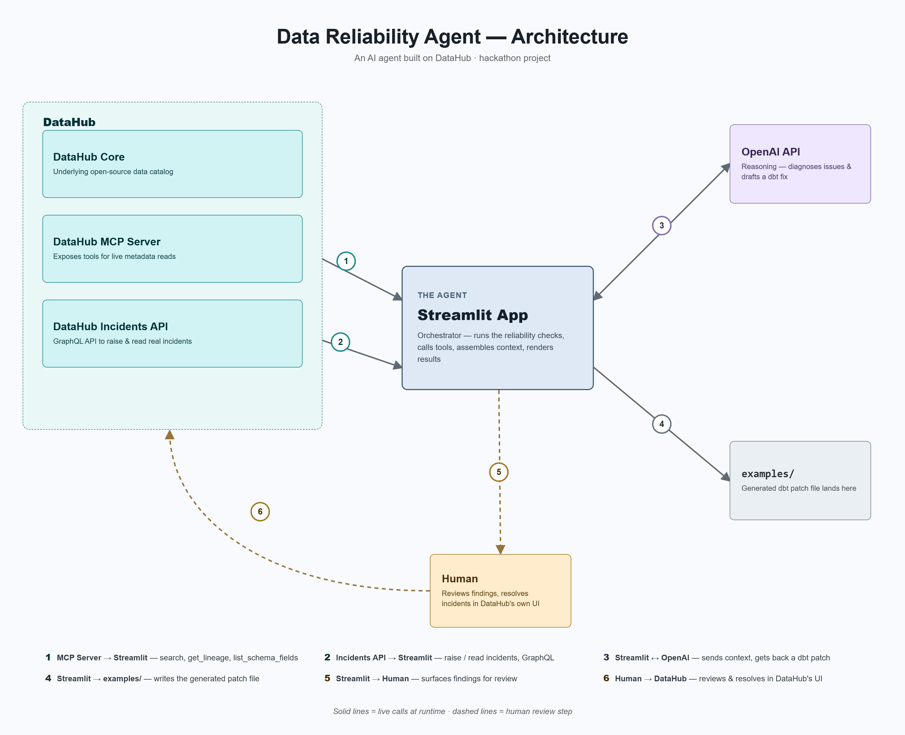

# Data Reliability Agent

An AI agent that watches a data pipeline in DataHub, catches risky schema changes before they break dashboards, investigates failures using real lineage and past incidents, and writes what it learns back into DataHub — where a human reviews and closes it out.

Built for the **Build with DataHub: Agent Hackathon** — "Agents That Do Real Work" track.

---

## The problem

Someone changes a column's type. It gets deployed. A dashboard breaks. Now someone spends an hour tracing through Slack messages and dashboards to figure out why, with no record left behind for the next person who hits the same issue.

This agent does that tracing automatically — and instead of just answering a question, it leaves real, permanent knowledge in DataHub for the next incident.

## What it actually does

1. **Warns before deployment** — flags a risky schema change as soon as it happens, before it ships
2. **Detects the failure** — when the downstream dashboard breaks
3. **Investigates for real** — reads live lineage and schema from DataHub via MCP, checks whether anything like this has happened before
4. **Remembers** — if a similar incident happened in the past, it says so ("raised 3 weeks ago") instead of starting from scratch
5. **Writes a real incident into DataHub** — using DataHub's native Incidents API, on the actual affected assets
6. **Generates a real fix** — a small dbt patch file, saved to `examples/`
7. **Hands off to a human** — the agent triages, a person resolves it inside DataHub itself

## Being upfront about what's real and what's simulated

We think this matters for judging, so here it is plainly:

- **The trigger** (schema change → deploy → dashboard failure) is **simulated** in the app, for a repeatable demo
- **Everything the agent reads** (lineage, schema, past incidents) is a **real, live call** to a running DataHub instance via its MCP Server
- **Everything the agent writes** (incidents, on real assets) is a **real write** to DataHub's native Incidents API — checkable by anyone with access to the DataHub instance, independent of this app



## How it works

```
Schema change + deploy (simulated)
        │
        ▼
Incident raised on source table  ──────▶  DataHub (real)
        │
Dashboard fails (simulated)
        │
        ▼
Incident raised on dashboard, references the first  ──▶  DataHub (real)
        │
"Investigate" clicked
        │
        ├─▶ MCP: search()             ──▶  DataHub (real)
        ├─▶ MCP: get_lineage()        ──▶  DataHub (real)
        ├─▶ MCP: list_schema_fields() ──▶  DataHub (real)
        ├─▶ Check past incidents      ──▶  DataHub (real)
        ├─▶ Reasoning (OpenAI)
        └─▶ Generate dbt patch        ──▶  saved to examples/
        │
        ▼
Human reviews in the Issues tab, resolves in DataHub's own UI
```

The agent isn't hardcoded to one table — this repo demonstrates it on one real scenario (`order_details` → PowerBI), but the underlying calls work against any asset in the catalog.

## Why DataHub

We picked DataHub because it's open source, runs in production at real scale (LinkedIn, Airbnb, and others), and it's built so agents can act on metadata directly through MCP — not just chat about it. That combination — real context plus a real write-back surface — is what makes an agent like this possible at all.

## Tech stack

- **Frontend/orchestration**: Python + Streamlit
- **Metadata platform**: DataHub (self-hosted, open source)
- **Agent context**: DataHub MCP Server (`search`, `get_lineage`, `list_schema_fields`)
- **Incident read/write**: DataHub's native Incidents GraphQL API
- **Reasoning**: OpenAI API
- **Generated artifact**: dbt SQL patch

## Setup

### Prerequisites
- Docker + Docker Compose
- Python 3.11+
- An OpenAI API key

### 1. Start DataHub
```bash
pip install acryl-datahub
datahub docker quickstart
datahub init          # accept defaults, leave token blank
datahub datapack load showcase-ecommerce
```

### 2. Set up the app
```bash
git clone <this-repo>
cd datahub-reliability-agent
python3 -m venv venv
source venv/bin/activate
pip install -r requirements.txt
```

### 3. Configure
Copy `.env.example` to `.env` and fill in your values:
```bash
cp .env.example .env
```

### 4. Run
```bash
streamlit run app.py --server.address 0.0.0.0
```
Open `http://localhost:8501`.

## Demo flow

1. Pick a column from the dropdown (pulled live from DataHub's schema)
2. Click through: **Schema Change & Deploy** → **Refresh Dashboard** → **Investigate**
3. Watch the live log — every real DataHub interaction is marked `✓ DataHub`
4. Check the **Operations Dashboard** tab for the summary, and **Issues** tab to triage and hand off to DataHub for resolution
5. Run the same column a second time to see the memory feature recognize the repeat

## Sample output

See `examples/` for a real generated dbt patch produced by the agent during a live run.

## Known limitations

- The memory-match compares incidents by affected column name — a simple, honest rule, not machine learning
- The demo scenario is scoped to one table pair for a clear, repeatable video; the agent's calls are generic across any asset
- Deployment and dashboard refresh are simulated app state, not live CI/CD or BI integrations

## License

Apache 2.0 — see [LICENSE](LICENSE).
